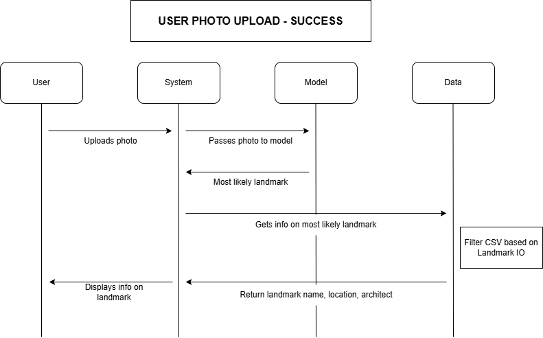
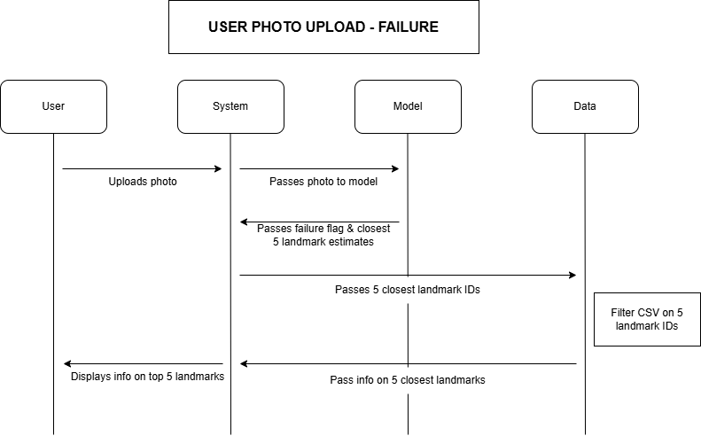
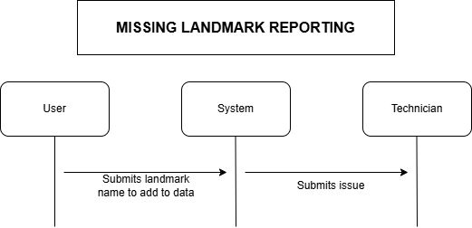
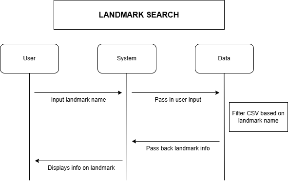

# COMPONENT DESIGN

## Components: 

### Image Classification Model: 
* The image classification model

### User Interface:
* Model demonstration and accuracy test page
    * Description of how to interpret model performance
    * INPUT: landmark images we took and have pre-loaded
    * OUTPUT: Model performance graphs section
* Home page: landmark classification page
    * Classifying landmarks from user input
    * INPUT: Section to allow user to upload picture
    * OUTPUT: Results section that displays user photo, stock landmark photo, and all the info on the landmark
* Landmark search page
    * Allows user to search through existing landmarks in dataset
    * INPUT: Search bar
    * OUTPUT: Results section that displays the stock photo and info on landmark
* Landmark Guessr page (game)
    * GeoGuessr-esque game for landmarks
    * Section for instructions
    * Start game button
    * Game mode page
    * Results (Win/lose) message page
    * INPUT: User's Guess
    * OUTPUT: Accuracy of User's Guess

### Data Management System: 
* Scraping data from Wikimedia
* Creating some way to store wikimedia and image data

# APPENDIX

## Component Diagrams

### User Photo Upload Success

### User Photo Upload Falure 

### Missing Landmark Reporting

### Landmark Search
