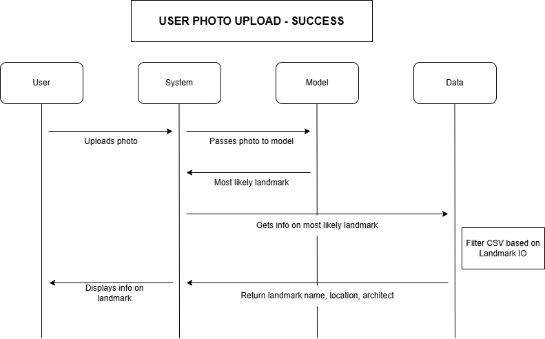
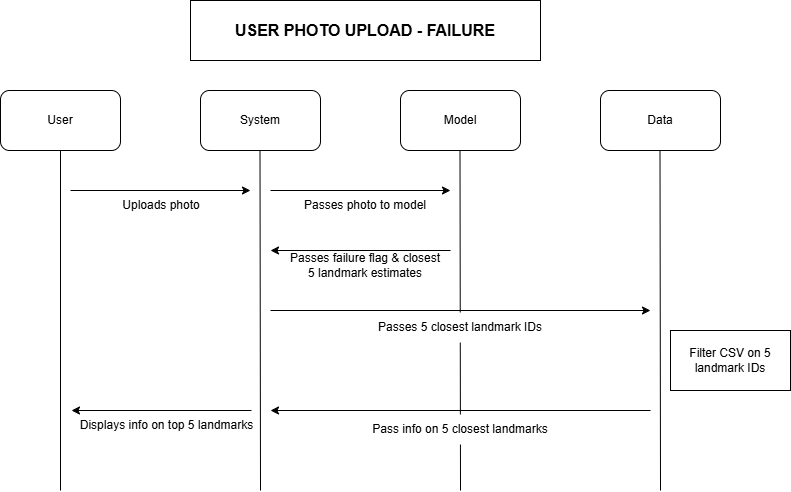
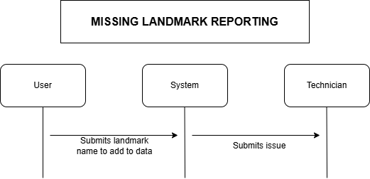
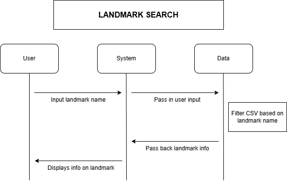

# COMPONENT DESIGN

## Components: 

### Image Classification Model: 
* The image classification model
* TRAINING INPUT: landmark images (PNGs, in folders for each landmark)
* INPUT: user-input image of landmark (reformatted to 224 x 224 x 3)
* OUTPUT: model-predicted landmark associated with INPUT, w/ prediction confidence
    * If confidence >= 50%, output top 1 landmark prediction
    * If confidence < 50%, output top 5 landmark predictions

### User Interface:
* Model demonstration and accuracy test page
    * Description of how to interpret model performance
    * INPUT: landmark images we took and have pre-loaded
    * OUTPUT: Model performance graphs section
* Home page: landmark classification page
    * Classifying landmarks from user input
    * INPUT: Section to allow user to upload picture
    * OUTPUT: Results section that displays user photo, stock landmark photo, and all the info on the landmark
* Landmark search page
    * Allows user to search through existing landmarks in dataset
    * INPUT: Search bar
    * OUTPUT: Results section that displays the stock photo and info on landmark
* Landmark Guessr page (game)
    * GeoGuessr-esque game for landmarks
    * Section for instructions
    * Start game button
    * Game mode page
    * Results (Win/lose) message page
    * INPUT: User's Guess
    * OUTPUT: Accuracy of User's Guess

### Data Management System: 
* Scraping data from Wikimedia
* Data Scraper
    * INPUT: Wikimedia URL for landmark, all landmark images
    * OUTPUT: 
        * full information about landmarks (e.g. name, location) in Washington state [CSV]
        * url for each clean image of landmarks in Washington state [CSV]
* Data Downloader
    * INPUT: image url for each clean image of landmarks in Washington state
    * OUTPUT: downloaded images, based on INPUT (PNGs, in folders for each landmark)

# APPENDIX

## Component Diagrams

### User Photo Upload Success

### User Photo Upload Failure 

### Missing Landmark Reporting

### Landmark Search
